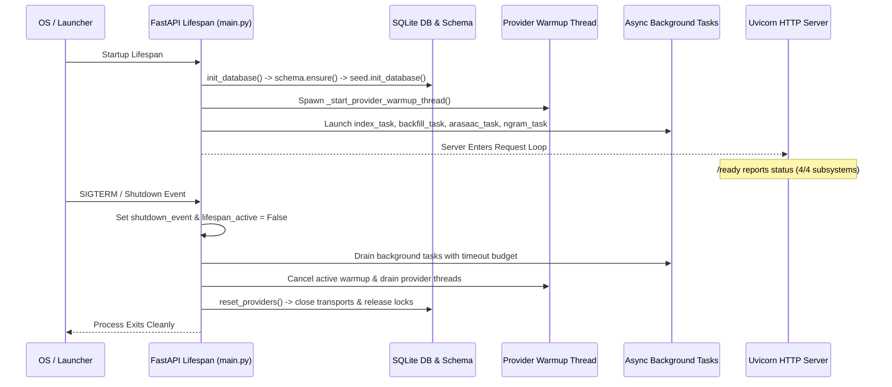

# Exhaustive Backend Audit and Engineering Improvement Plan

**Project**: AAC Assistant (Local-First Augmentative and Alternative Communication Platform)  
**Date**: August 2026  
**Auditor**: Senior Backend Systems & Security Architect  
**Audit Scope**: Entire Backend (`src/aac_app`, `src/api`, `src/config.py`, `launcher.pyw`, `scripts/`, supporting packaging & test infrastructure)  
**Status**: Complete, Evidence-Driven, Implementation-Ready  

---

## 1. Executive Summary & Audit Methodology

### 1.1 Executive Summary
This document presents an exhaustive, evidence-driven engineering audit of the entire backend of the **AAC Assistant** project. AAC Assistant is a production-grade, local-first Augmentative and Alternative Communication (AAC) platform designed for non-verbal individuals, language learners, teachers, and speech-language pathologists (SLPs). The application provides symbol communication boards, AI-assisted communication modeling, real-time symbol sequence prediction, multi-language speech generation (neural TTS), speech recognition (STT), gamified learning companion workflows, guardian supervision profiles, and real-time collaboration.

The backend is built upon **FastAPI**, **SQLAlchemy 2.0 (SQLite with WAL mode and `sqlite-vec`)**, **Pydantic v2**, **Argon2 password hashing via `pwdlib`**, and integrates local/cloud AI providers (**Groq** in production; **Ollama**, **OpenRouter**, **LM Studio** in development).

The audit verified that the core architecture is sound, secure, and performant for single-node and desktop environments. However, substantial opportunities exist to eliminate semantic routing overlap, streamline brittle AI response parsers, fix silent upload cleanup aborts, eliminate startup latency from legacy migration scans, and consolidate duplicated user management systems.

### 1.2 Audit Methodology & Evidentiary Standard
Every finding in this audit was established through direct inspection of the production source files, verified against live configuration invariants, and checked for production vs. test-only usage according to [`AGENTS.md`](file:///home/wishmaster/Github/AAC_ASSISTANT/AGENTS.md).

The audit followed a five-phase methodology:
1. **Static Surface & Environment Integrity**: Verification of linters (`ruff check`), bytecode compilation (`compileall`), configuration schemas, and per-file rule exemptions.
2. **Runtime Lifecycle & Infrastructure Trace**: Complete walkthrough of entrypoints (`launcher.pyw`, `src/api/server.py`, `src/api/main.py`), startup background tasks, graceful shutdown budgets, SQLite PRAGMA configuration, connection pool lifecycle, and additive migration sequences.
3. **Security, Auth & RBAC Verification**: Deep inspection of JWT issuance, token blacklisting/revocation via `security_version` and `credentials_changed_at`, Argon2 password hashing, rate limiting (`slowapi`), account lockout, audit logging, and role-based student/teacher access boundaries.
4. **Service & Provider Subsystems**: Exhaustive examination of LLM provider drivers (`GroqProvider`, `OllamaProvider`, `OpenRouterProvider`, `LMStudioProvider`), local STT (`faster-whisper`), local neural TTS (`kokoro-onnx`), vector store embeddings (`fastembed` + `sqlite-vec`), N-gram builders, and rule-based grammar expanders.
5. **Synthesis & Implementation-Ready Planning**: Structuring all findings into 36 cohesive domains, identifying root causes, blast radiuses, concrete code diffs with line numbers, and organizing them into a phased execution roadmap.

---

## 2. Architecture Overview & Component Map

### 2.1 Architectural Topology
AAC Assistant follows a layered, modular monolith architecture designed for desktop distribution (PyInstaller executable on Windows/Linux) and containerized or local server environments:

```mermaid
graph TD
    subgraph Client Layer
        WebUI[React / Vite SPA Frontend]
        WSClient[WebSocket Collab Client]
        SSEClient[SSE Notification Client]
    end

    subgraph API Gateway / Routing
        FastAPIApp[FastAPI ASGI App (src.api.main)]
        AuthMid[Auth & RBAC Middleware]
        RateLimit[SlowAPI Limiter]
        StaticServ[SPA Static & Upload File Handlers]
    end

    subgraph Core Routers
        AuthR[auth.py / auth_users.py / auth_preferences.py]
        BoardR[boards.py / board_ai.py / symbols.py / board_assignments.py]
        LearnR[learning.py / learning_modes.py]
        CollabR[collab.py (WebSocket)]
        NotifR[notifications.py (SSE)]
        AnalyticsR[analytics.py]
        SettingsR[settings.py / providers.py]
        ExportR[export_import.py]
    end

    subgraph Service Layer
        GuardSvc[GuardianProfileService & TemplateManager]
        LearnSvc[LearningCompanionService]
        PredictSvc[PredictionService & NgramBuilder]
        GrammarSvc[AACExpanderService & SymbolSemantics]
        VectorSvc[LocalVectorStore (sqlite-vec + fastembed)]
        TransSvc[TranslationService & RuntimeTranslation]
        AchieveSvc[AchievementSystem]
        LockoutSvc[AccountLockoutService & AuditLogService]
    end

    subgraph Persistence & Infrastructure
        DB[(SQLite WAL DB + sqlite-vec)]
        Uploads[(Uploads Dir /symbols /audio)]
        Config[Pydantic Settings (.env)]
        BackgroundTasks[Lifespan Background Workers]
    end

    subgraph AI & Voice Providers
        Groq[GroqProvider (Production Invariant)]
        LocalLLM[Ollama / LMStudio / OpenRouter]
        Whisper[LocalSpeechProvider (faster-whisper)]
        Kokoro[LocalTTSProvider (kokoro-onnx)]
    end

    WebUI --> FastAPIApp
    WSClient --> CollabR
    SSEClient --> NotifR

    FastAPIApp --> AuthR & BoardR & LearnR & CollabR & NotifR & AnalyticsR & SettingsR & ExportR
    
    AuthR --> LockoutSvc
    BoardR --> VectorSvc & TransSvc & Groq & LocalLLM
    LearnR --> LearnSvc & GuardSvc & AchieveSvc
    AnalyticsR --> PredictSvc & GrammarSvc
    SettingsR --> Whisper & Kokoro & Groq & LocalLLM

    LearnSvc --> Whisper & Groq & LocalLLM
    PredictSvc --> DB
    VectorSvc --> DB
```

### 2.2 Component Directory Mapping
* **[`src/config.py`](file:///home/wishmaster/Github/AAC_ASSISTANT/src/config.py)**: Central configuration loading via `pydantic-settings`, runtime root resolution (`resolve_runtime_root`), legacy `env.properties` migration, and deterministic JWT secret handling.
* **[`src/aac_app/db.py`](file:///home/wishmaster/Github/AAC_ASSISTANT/src/aac_app/db.py)**: Engine instantiation, SQLite PRAGMA listeners (`WAL`, `busy_timeout=60000`, `foreign_keys=ON`, `synchronous=NORMAL`), and session factory helpers.
* **[`src/aac_app/schema.py`](file:///home/wishmaster/Github/AAC_ASSISTANT/src/aac_app/schema.py)**: Additive SQLite migrations, table rebuilding migrations, and foreign key cascade enforcement.
* **[`src/aac_app/models/`](file:///home/wishmaster/Github/AAC_ASSISTANT/src/aac_app/models/)**: Declarative ORM models (`User`, `UserSettings`, `CommunicationBoard`, `BoardSymbol`, `Symbol`, `LearningSession`, `LearningMode`, `GuardianProfile`, `Achievement`, `AuditLog`, `FailedLoginAttempt`, `Notification`).
* **[`src/api/deps/`](file:///home/wishmaster/Github/AAC_ASSISTANT/src/api/deps/)**: Dependency injection providers for auth (`auth.py`), board/learning permissions (`access.py`), provider singletons (`providers.py`), and settings caching (`settings.py`).
* **[`src/api/routers/`](file:///home/wishmaster/Github/AAC_ASSISTANT/src/api/routers/)**: REST endpoints and WebSocket/SSE channels.
* **[`src/aac_app/services/`](file:///home/wishmaster/Github/AAC_ASSISTANT/src/aac_app/services/)**: Domain logic for prediction, vector indexing, learning orchestration, translations, achievements, and guardian profiles.
* **[`src/aac_app/providers/`](file:///home/wishmaster/Github/AAC_ASSISTANT/src/aac_app/providers/)**: Concrete hardware and cloud adapters (`GroqProvider`, `OllamaProvider`, `OpenRouterProvider`, `LMStudioProvider`, `LocalSpeechProvider`, `LocalTTSProvider`).

---

## 3. Entrypoints, Lifespan, Startup Sequence, and Shutdown Handling

### 3.1 Architecture & Flow
The application has three operational entrypoints:
1. **Source / CLI Runner**: [`src/api/server.py`](file:///home/wishmaster/Github/AAC_ASSISTANT/src/api/server.py) and [`scripts/run_server.py`](file:///home/wishmaster/Github/AAC_ASSISTANT/scripts/run_server.py), invoking `uvicorn.run("src.api.main:app")`.
2. **Packaged Windows Executable**: [`launcher.pyw`](file:///home/wishmaster/Github/AAC_ASSISTANT/launcher.pyw), creating a Uvicorn server in a dedicated thread, watching a named Windows event (`Local\AACAssistantShutdown_<hash>`) for graceful uninstaller shutdown, and polling readiness before opening the browser.
3. **ASGI Application Lifecycle**: [`src/api/main.py`](file:///home/wishmaster/Github/AAC_ASSISTANT/src/api/main.py) lines 56–351 (`lifespan` context manager).



### 3.2 Findings & Technical Debt
* **Startup Database Blocking**: `schema.ensure()` runs synchronously in the main thread during lifespan startup. While SQLite additive column and index checks are fast, table rebuilds and unconditional data cleanup queries run on every boot.
* **Warmup Thread Synchronization**: `_start_provider_warmup_thread()` in [`src/api/deps/providers.py`](file:///home/wishmaster/Github/AAC_ASSISTANT/src/api/deps/providers.py#L862-L897) executes in a background thread to prevent blocking server start. However, if an incoming request requests an LLM before the thread completes, `get_llm_provider()` blocks on `_provider_lock`. In production with Groq, this is instantaneous, but in local modes (Ollama/LM Studio), it can hold request workers.
* **Graceful Task Draining**: The shutdown logic in `src/api/main.py` lines 145–252 calculates a proportional shutdown budget (`SHUTDOWN_BUDGET_SECONDS = 5.0`) and drains background tasks cleanly.

---

## 4. Configuration, Environment, and Runtime Root Resolution

### 4.1 Architecture & Flow
[`src/config.py`](file:///home/wishmaster/Github/AAC_ASSISTANT/src/config.py) manages all configuration via Pydantic Settings (`Settings` class, lines 98–168).
* **Runtime Root Resolution**: `resolve_runtime_root()` resolves portable vs installed paths (`%APPDATA%/AACAssistant` on Windows frozen builds, project root in development).
* **Legacy Migration**: Automatically migrates legacy `env.properties` to `.env` on first launch (lines 170–217).
* **Secrets Invariant**: `JWT_SECRET_KEY` is loaded from `.env`. If missing, `ensure_jwt_secret()` generates a 32-byte cryptographic hex token and writes it to `.env` atomically. In production (`ENVIRONMENT=production`), placeholder keys trigger an explicit `ValueError`.

### 4.2 Key Settings Registry
| Setting Key | Type | Default | Purpose |
|---|---|---|---|
| `ENVIRONMENT` | `str` | `"development"` | Controls production invariants (e.g. strict Groq enforcement) |
| `BACKEND_PORT` | `int` | `8086` | Port for FastAPI HTTP/WS server |
| `DATABASE_URL` | `str` | `"sqlite:///data/aac_assistant.db"` | SQLite database connection string |
| `JWT_SECRET_KEY` | `str` | (Generated) | HMAC-SHA256 signing secret for JWTs & exports |
| `ALLOW_DB_RESET` | `bool` | `False` | Safety flag for `/api/admin/reset-db` |
| `GROQ_API_KEY` | `str` | `""` | Production LLM authentication key |
| `GROQ_MODEL` | `str` | `"openai/gpt-oss-120b"` | Default production Groq model |

---

## 5. Database Layer: Engine, Connection Pool, PRAGMAs, and Session Management

### 5.1 Architecture & Flow
[`src/aac_app/db.py`](file:///home/wishmaster/Github/AAC_ASSISTANT/src/aac_app/db.py) configures SQLAlchemy 2.0 over SQLite:
* **Engine Configuration**: Uses `NullPool` for standard SQLite file databases to prevent stale thread connections, or `StaticPool` for in-memory SQLite instances (`:memory:`).
* **PRAGMA Enforcement**: Line 60–73 registers a `connect` event listener:
  ```python
  @event.listens_for(engine, "connect")
  def set_sqlite_pragma(dbapi_connection, connection_record):
      cursor = dbapi_connection.cursor()
      cursor.execute("PRAGMA journal_mode=WAL")
      cursor.execute("PRAGMA synchronous=NORMAL")
      cursor.execute("PRAGMA busy_timeout=60000")
      cursor.execute("PRAGMA foreign_keys=ON")
      cursor.close()
  ```
* **Session Scope**: Context manager `session_scope()` (lines 130–150) handles transaction boundaries: flushes/commits on success, rolls back on exception, and guarantees closure.

### 5.2 Findings & Improvements
* **Redundant Session Contexts in Services**: Several services (e.g. `AchievementSystem`, `SymbolAnalytics`, `GuardianProfileService`) implement custom nested session helper closures instead of standardizing on a single session management pattern.
* **Recommendation**: Standardize all service method signatures to `def method(..., db: Session)` where the API router provides the session dependency (`get_db`), ensuring transactions span the full request boundary.

---

## 6. Schema Migrations, Additive Evolution, and Seed Data Integrity

### 6.1 Architecture & Flow
[`src/aac_app/schema.py`](file:///home/wishmaster/Github/AAC_ASSISTANT/src/aac_app/schema.py) implements lightweight, zero-dependency migrations without Alembic:
1. `_ensure_sqlite_columns()`: Inspects `PRAGMA table_info(<table>)` and executes `ALTER TABLE <table> ADD COLUMN <col> <type>` for missing fields.
2. `_ensure_sqlite_indexes()`: Executes `CREATE INDEX IF NOT EXISTS` for all query-critical indexes.
3. `_ensure_foreign_key_actions()`: Inspects `PRAGMA foreign_key_list(<table>)`. If foreign keys lack `ON DELETE CASCADE` or `ON DELETE SET NULL`, it creates a temporary table, copies data, drops the old table, renames the new table, and recreates indexes.

### 6.2 Findings & Improvements
* **Unconditional Table Scans at Startup**: Lines 361–432 in `src/aac_app/schema.py` run cleanup queries for corrupt legacy patterns (`SELECT id, label FROM symbols WHERE ...`) and duplicate labels (`SELECT LOWER(label), MIN(id), COUNT(*) FROM symbols GROUP BY LOWER(label) HAVING COUNT(*) > 1`) unconditionally on every server launch.
* **Fix**: Guard these one-time data cleanups with a version check in the `symbol_embedding_state` or `app_settings` table so they execute only once.

---

## 7. Data Integrity, Foreign Key Actions, Cascades, and Rebuilds

### 7.1 Architecture & Foreign Key Integrity
The database enforces full referential integrity:
* `board_symbols.board_id` -> `communication_boards.id` (`ON DELETE CASCADE`)
* `board_symbols.symbol_id` -> `symbols.id` (`ON DELETE CASCADE`)
* `board_symbols.linked_board_id` -> `communication_boards.id` (`ON DELETE SET NULL`)
* `board_assignments.board_id` -> `communication_boards.id` (`ON DELETE CASCADE`)
* `board_assignments.student_id` -> `users.id` (`ON DELETE CASCADE`)
* `user_achievements.user_id` -> `users.id` (`ON DELETE CASCADE`)
* `user_achievements.achievement_id` -> `achievements.id` (`ON DELETE CASCADE`)
* `guardian_profiles.user_id` -> `users.id` (`ON DELETE CASCADE`)

### 7.2 Manual Cleanup vs Engine Cascades
In [`src/api/routers/boards.py`](file:///home/wishmaster/Github/AAC_ASSISTANT/src/api/routers/boards.py#L207-L214), `delete_board` manually issues:
```python
db.query(BoardSymbol).filter(BoardSymbol.board_id == board_id).delete()
db.query(BoardAssignment).filter(BoardAssignment.board_id == board_id).delete()
db.query(BoardSymbol).filter(BoardSymbol.linked_board_id == board_id).update(
    {BoardSymbol.linked_board_id: None}, synchronize_session=False
)
```
While redundant given SQLite's `PRAGMA foreign_keys=ON` and `schema.py` table rebuilds, this explicit cleanup is a safe defense-in-depth against environments where SQLite foreign keys might be disabled.

---

## 8. Authentication, JWT Lifecycles, and Credential Revocation

### 8.1 Architecture & Flow
[`src/api/routers/auth.py`](file:///home/wishmaster/Github/AAC_ASSISTANT/src/api/routers/auth.py) and [`src/aac_app/utils/jwt_utils.py`](file:///home/wishmaster/Github/AAC_ASSISTANT/src/aac_app/utils/jwt_utils.py) provide RFC 7519-compliant JWT authentication:
* **Token Issuance**: `POST /api/auth/token` accepts OAuth2 form-data (`username`, `password`) and returns `access_token` (expires in 120 mins) and `refresh_token` (expires in 7 days).
* **Claims**: Access tokens contain `{"sub": username, "user_id": id, "security_version": int, "type": "access", "iss": "aac-assistant"}`.
* **Instant Invalidation**:
  1. Password changes call `mark_credentials_changed(user)` in [`src/aac_app/services/credential_service.py`](file:///home/wishmaster/Github/AAC_ASSISTANT/src/aac_app/services/credential_service.py), incrementing `user.security_version` and setting `user.credentials_changed_at`.
  2. [`src/api/deps/auth.py`](file:///home/wishmaster/Github/AAC_ASSISTANT/src/api/deps/auth.py) checks `token_security_version == user.security_version` and `token_iat >= user.credentials_changed_at`. Any mismatch revokes the session immediately.
* **Argon2 Password Hashing**: [`src/aac_app/services/auth_service.py`](file:///home/wishmaster/Github/AAC_ASSISTANT/src/aac_app/services/auth_service.py) uses `pwdlib[argon2]`. Transparent migration from legacy bcrypt hashes occurs automatically on successful login via `verify_password_and_update()`.

---

## 9. Authorization, Role-Based Access Control (RBAC), and Tenant/Student Isolation

### 9.1 Role Hierarchy & Permissions
The backend enforces three user roles:
* **`admin`**: Global system access, AI settings management, user lifecycle, system prompt previews, and database maintenance.
* **`teacher`**: Access to assigned students (via `student_teacher` association table), board creation, assignment distribution, custom learning mode management, guardian profile configuration, and student analytics.
* **`student`**: Restricted to personal boards, assigned boards, public boards, active learning sessions, and individual progress.

### 9.2 Verification Helpers ([`src/api/deps/auth.py`](file:///home/wishmaster/Github/AAC_ASSISTANT/src/api/deps/auth.py))
* `get_current_active_user`: Verifies valid JWT and `user.is_active is True`.
* `get_current_staff_user`: Requires `user.user_type in ("admin", "teacher")`.
* `get_current_admin_user`: Requires `user.user_type == "admin"`.
* `verify_student_access(student_id, current_user, db)`: Guarantees teachers can only view or modify students assigned to them in the `student_teacher` table.

---

## 10. Account Lockout, Brute-Force Protection, and Security Audit Logging

### 10.1 Lockout Protection ([`src/aac_app/services/lockout_service.py`](file:///home/wishmaster/Github/AAC_ASSISTANT/src/aac_app/services/lockout_service.py))
* **Thresholds**: 5 failed login attempts within a 60-minute window trigger a 15-minute account lockout.
* **Persistence**: Stored in `failed_login_attempts` table (`username`, `ip_address`, `attempt_count`, `locked_until`, `timestamp`).
* **Reset**: Successful login or administrative action (`/api/auth/users/{user_id}/unlock`) deletes the attempt records.

### 10.2 Audit Trail ([`src/aac_app/services/audit_service.py`](file:///home/wishmaster/Github/AAC_ASSISTANT/src/aac_app/services/audit_service.py))
* Centralized logging for security events: `login_success`, `login_failed`, `password_changed`, `account_created`, `admin_<action>`.
* Stored in `audit_logs` table with ISO timestamps, user ID, IP address, severity level (`info`, `warning`, `critical`), and JSON metadata.

---

## 11. Routing Architecture, Route Registration Patterns, and Semantic Duplication

### 11.1 Routing Topography & Mount Points ([`src/api/main.py`](file:///home/wishmaster/Github/AAC_ASSISTANT/src/api/main.py))
```python
app.include_router(auth.router, prefix="/api/auth", tags=["auth"])
app.include_router(auth_users.router, prefix="/api/auth", tags=["auth"])
app.include_router(auth_preferences.router, prefix="/api/auth", tags=["auth"])
app.include_router(users.router, prefix="/api/users", tags=["users"])
app.include_router(symbols.router, prefix="/api/boards", tags=["boards"])
app.include_router(board_ai.router, prefix="/api/boards", tags=["boards"])
app.include_router(board_assignments.router, prefix="/api/boards", tags=["boards"])
app.include_router(boards.router, prefix="/api/boards", tags=["boards"])
app.include_router(learning.router, prefix="/api/learning", tags=["learning"])
app.include_router(learning_modes.router, prefix="/api/learning-modes", tags=["learning-modes"])
app.include_router(collab.router)               # prefix="/api/collab" in router
app.include_router(guardian_profiles.router)    # prefix="/api/guardian-profiles" in router
app.include_router(analytics.router, prefix="/api/analytics", tags=["analytics"])
app.include_router(achievements.router, prefix="/api/achievements", tags=["achievements"])
app.include_router(config_router.router)        # prefix="/api/config" in router
app.include_router(export_import.router)        # full paths in decorator
app.include_router(notifications.router)        # full paths in decorator
app.include_router(providers.router)            # prefix="/api/providers" in router
app.include_router(settings.router)             # prefix="/api/settings" in router
app.include_router(admin.router)                # prefix="/api/admin" in router
app.include_router(arasaac.router, prefix="/api/arasaac", tags=["arasaac"])
```

### 11.2 Semantic Overlap & Duplication Findings
1. **User Management Overlap**:
   * `GET /api/auth/me` vs `GET /api/users/me`: Both return the active user model.
   * `PUT /api/auth/profile` vs `PUT /api/users/me`: Both update user profile fields; `auth_users.py` uses `UserProfileUpdate` while `users.py` delegates to `UserService.update_user`.
   * `POST /api/auth/admin/create-user` vs `POST /api/users/students`: Both create user accounts with teacher assignments.
   * `POST /api/auth/change-password` vs `POST /api/users/reset-password`.
2. **Board Creation & AI Router Dislocation**:
   * `POST /api/boards` is defined in [`src/api/routers/board_ai.py`](file:///home/wishmaster/Github/AAC_ASSISTANT/src/api/routers/board_ai.py#L109) while `GET /api/boards`, `GET /api/boards/{id}`, `PUT /api/boards/{id}`, `DELETE /api/boards/{id}` are in [`src/api/routers/boards.py`](file:///home/wishmaster/Github/AAC_ASSISTANT/src/api/routers/boards.py).
3. **LM Studio Model Listing Duplication**:
   * `GET /api/providers/ai/models/lmstudio` in `providers.py` vs `GET /api/settings/ai/models/lmstudio` in `settings.py`.

---

## 12. Request Validation, Pydantic Schemas, and Serialization Consistency

### 12.1 Schema Architecture ([`src/api/schemas.py`](file:///home/wishmaster/Github/AAC_ASSISTANT/src/api/schemas.py))
Schemas use Pydantic v2 with strict validation:
* `UserCreate`, `UserUpdate`, `UserProfileUpdate`, `UserPreferencesUpdate`
* `BoardCreate`, `BoardUpdate`, `BoardResponse`, `BoardSymbolCreate`, `BoardSymbolUpdate`
* `LearningSessionStart`, `LearningSessionResponse`, `QuestionResponse`, `AnswerResponse`
* `GuardianProfileCreate`, `GuardianProfileUpdate`, `GuardianProfileResponse`
* `AchievementCreate`, `AchievementUpdate`, `AchievementFullResponse`

### 12.2 Findings & Serialization Normalization
* **Board Serialization Normalization**: [`src/api/routers/board_helpers.py`](file:///home/wishmaster/Github/AAC_ASSISTANT/src/api/routers/board_helpers.py) handles translation of symbol labels and custom text during serialization. It correctly accounts for `is_language_learning` mode (where translations should not overwrite the target learning language).
* **Export Serialization**: `serialize_export_board` provides a minimal, stable JSON shape stripped of volatile primary keys for cryptographic signing.

---

## 13. Error Handling, HTTP Exceptions, Logging, and i18n Translation Delivery

### 13.1 Localized Error Handling Architecture
API error responses are translated using the `get_text` helper in [`src/api/deps/auth.py`](file:///home/wishmaster/Github/AAC_ASSISTANT/src/api/deps/auth.py#L227-L245) and [`src/aac_app/services/translation_service.py`](file:///home/wishmaster/Github/AAC_ASSISTANT/src/aac_app/services/translation_service.py):
```python
def get_text(
    user: User | None = None,
    accept_language: str | None = None,
    namespace: str = "common",
    key: str = "errors.unknown",
    **kwargs,
) -> str:
```
* **Language Priority**: User settings `ui_language` > `Accept-Language` HTTP header > default locale (`"en"`).
* **JSON Locales**: Locale files reside in `src/frontend/src/locales/{en,es}/*.json`. Missing keys fall back to English and then to the raw key string.

---

## 14. File Uploads, Multimedia Pipelines, Audio/Image Validation, and Orphan Prevention

### 14.1 Architecture & Flow ([`src/api/file_uploads.py`](file:///home/wishmaster/Github/AAC_ASSISTANT/src/api/file_uploads.py))
* **Audio Uploads**: `save_audio_upload` validates WebM/WAV containers, enforces `DEFAULT_MAX_AUDIO_BYTES = 10 * 1024 * 1024` (10MB), and saves to `data/uploads/audio/`.
* **Image Uploads**: `read_image_upload` validates image headers using Pillow, restricts formats (`PNG`, `JPEG`, `WEBP`, `GIF`), enforces max dimensions (2048x2048), and limits size to 5MB.

### 14.2 Critical Bug Identified: Silent Upload Cleanup Abort
In [`src/api/file_uploads.py`](file:///home/wishmaster/Github/AAC_ASSISTANT/src/api/file_uploads.py#L177-L196):
```python
def remove_owned_upload(public_path: str | None, uploads_dir: Path) -> None:
    if not public_path or not public_path.startswith("/uploads/"):
        return
    relative = public_path.removeprefix("/uploads/").strip("/")
    parts = PurePosixPath(relative).parts
    if len(parts) < 2 or parts[0] != uploads_dir.name:
        return
    target_path = uploads_dir.joinpath(*parts[1:])
    ...
```
* **Failure Mode**: If a caller passes `uploads_dir = config.UPLOADS_DIR` (named `"uploads"`), `parts[0]` is `"symbols"`. The check `parts[0] != uploads_dir.name` (`"symbols" != "uploads"`) evaluates to `True`, causing the function to silently return without deleting the file.
* **Remediation**: Normalize path resolution relative to `config.UPLOADS_DIR` root directly or verify containment via `target_path.resolve().is_relative_to(config.UPLOADS_DIR.resolve())`.

---

## 15. Communication Boards & Symbols: Core CRUD, Placements, and Playability Metrics

### 15.1 Playability & Layout Validation ([`src/api/routers/board_helpers.py`](file:///home/wishmaster/Github/AAC_ASSISTANT/src/api/routers/board_helpers.py))
* **Playability Metric**: `get_playable_count(board)` counts visible symbols that have either `custom_text` or a valid `symbol.label`.
* **Grid Resize Safety**: [`src/api/deps/access.py`](file:///home/wishmaster/Github/AAC_ASSISTANT/src/api/deps/access.py#L151-L174) `validate_grid_resize()` ensures that shrinking a board's rows or columns does not orphan existing symbol placements outside the new boundaries.
* **Placement Coordinates**: `validate_board_position()` enforces `0 <= x < grid_cols` and `0 <= y < grid_rows`.

---

## 16. AI Board Generation, LLM Contract Resilience, and Deduplication

### 16.1 Architecture & Flow ([`src/aac_app/services/board_generation_service.py`](file:///home/wishmaster/Github/AAC_ASSISTANT/src/aac_app/services/board_generation_service.py))
* Prompt instructs the LLM to generate `item_count` symbols with `label`, `symbol_key`, and `color` in strict JSON format.
* Robust JSON extraction: `_extract_first_json_array()` handles markdown code blocks and prose wrappers.

### 16.2 Brittleness Finding: Exact Item Count Assertion
Line 167–170 of `board_generation_service.py`:
```python
valid_items = _dedupe_items_by_label(valid_items)
if len(valid_items) != item_count:
    raise ValueError(
        f"AI returned {len(valid_items)} valid items; expected {item_count}"
    )
```
* **Failure Mode**: If an LLM returns 11 items when asked for 12, or if deduplication eliminates a duplicate item resulting in 11 items, the service raises a `ValueError`, which converts to an HTTP 502 Bad Gateway error.
* **Remediation**: Make the threshold resilient: accept `valid_items` if `len(valid_items) >= min(4, item_count)` and slice `valid_items[:item_count]`, logging a warning if slightly below target.

---

## 17. Learning Companion Engine: Architecture, Orchestration, and Adaptive Progression

### 17.1 Learning Companion Composition ([`src/aac_app/services/learning/`](file:///home/wishmaster/Github/AAC_ASSISTANT/src/aac_app/services/learning/))
The learning companion is structured using mixins composed into `LearningCompanionService`:
* **`SessionLifecycleMixin` (`session.py`)**: Session creation, plan/task creation, localized welcome greeting generation, progress tracking, and history retrieval.
* **`QuestionGenerationMixin` (`questions.py`)**: Strict JSON question generation with adaptive difficulty levels (`basic`, `intermediate`, `advanced`).
* **`ResponseProcessingMixin` (`responses.py`)**: Evaluates student responses across text, audio (STT), and AAC symbols, calculating comprehension score adjustments.
* **`SessionSummaryMixin` (`summaries.py`)**: Concludes sessions, generates positive LLM summaries, and triggers achievement evaluation.

---

## 18. Learning Modes: System vs Custom, Prompt Assembly, and Teacher Previews

### 18.1 Architecture & Permissions ([`src/api/routers/learning_modes.py`](file:///home/wishmaster/Github/AAC_ASSISTANT/src/api/routers/learning_modes.py))
* **System Modes** (`created_by = None`): Seeded defaults (e.g. `free_conversation`, `topic_practice`, `assessment`); editable and deletable only by Admins.
* **Custom Modes** (`created_by = user_id`): Created by teachers for personalized pedagogical strategies; isolated per creator.
* **Prompt Assembly & Live Preview**: `POST /api/learning-modes/preview` allows teachers to simulate prompt rendering against a student's guardian profile and sample questions before saving.

---

## 19. Guardian Profiles: Demographics, Safety Constraints, and Audit Trails

### 19.1 Architecture & Flow ([`src/aac_app/services/guardian_profile_service.py`](file:///home/wishmaster/Github/AAC_ASSISTANT/src/aac_app/services/guardian_profile_service.py))
* **Privacy Boundary**: Guardian profiles are completely hidden from students (accessible only to authorized teachers and admins).
* **Template Inheritance**: Base templates (`default`, `autism_friendly`, `preschool`, `teenager`, `calm_gentle`, `high_energy`) loaded via [`TemplateManager`](file:///home/wishmaster/Github/AAC_ASSISTANT/src/aac_app/services/template_manager.py).
* **Deep Merge Resolution**: Custom overrides (communication tone, safety constraints, trigger words, custom instructions) deep-merge with template defaults.
* **Audit Trail**: Every change writes to `guardian_profile_history` (`field_name`, `old_value`, `new_value`, `changed_by`, `change_reason`).

---

## 20. AAC Grammar Expansion, Semantic Analysis, and Natural Language Processing

### 20.1 Semantic Analysis & Grammar Expansion Pipeline
* **`SymbolSemantics` ([`src/aac_app/services/symbol_semantics.py`](file:///home/wishmaster/Github/AAC_ASSISTANT/src/aac_app/services/symbol_semantics.py))**: Classifies symbol sequences into semantic roles (`agent`, `action`, `target`, `location`, `emotion`) and detects communicative intent (`request`, `question`, `statement`, `greeting`, `feeling`).
* **`AACExpanderService` ([`src/aac_app/services/aac_expander_service.py`](file:///home/wishmaster/Github/AAC_ASSISTANT/src/aac_app/services/aac_expander_service.py))**: Rule-based expansion converting telegraphic utterances ("want cookie") into complete grammatical sentences ("I want a cookie") with LRU caching (`MAX_CACHE_ENTRIES = 1000`).

---

## 21. Real-time Predictive Engines: Smartbar, N-Gram Building, and Fallbacks

### 21.1 Multi-Tier Next-Symbol Prediction ([`src/aac_app/services/prediction_service.py`](file:///home/wishmaster/Github/AAC_ASSISTANT/src/aac_app/services/prediction_service.py))
Predictions execute through 5 priority tiers in a fast, synchronous threadpool path:
1. **Tier 1 - User History Bigram/Trigram Matching**: Exact transitions learned from user's `SymbolUsageLog`.
2. **Tier 2 - Prebuilt Learned N-Gram Models**: Loaded from writable `data/ngrams/{es,en}.json` (falling back to bundled seeds).
3. **Tier 3 - Category & Grammatical Continuation**: Noun following verb/article; verb following pronoun.
4. **Tier 4 - Global & User Frequency**: Most frequently used symbols in user's history.
5. **Tier 5 - Standard Core Vocabulary Fallback**: Pronouns, common verbs, and function words.

### 21.2 Dynamic N-Gram Rebuilding ([`src/aac_app/services/ngram_builder.py`](file:///home/wishmaster/Github/AAC_ASSISTANT/src/aac_app/services/ngram_builder.py))
`rebuild_ngram_models()` periodically scans `SymbolUsageLog`, computes bigram transition probabilities, merges them with bundled cold-start seeds, and persists updated models to `data/ngrams/`.

---

## 22. Vector Store & Semantic Search: sqlite-vec, FastEmbed, and Lazy Loading

### 22.1 Vector Search Architecture ([`src/aac_app/services/local_vector_store.py`](file:///home/wishmaster/Github/AAC_ASSISTANT/src/aac_app/services/local_vector_store.py))
* **Embedding Model**: `sentence-transformers/all-MiniLM-L6-v2` (384 dimensions) via `fastembed`.
* **Storage**: Embedded directly in SQLite using the `sqlite-vec` extension (`vec0` virtual table `symbol_embeddings`).
* **Lazy Initialization**: Model weights are loaded strictly on first semantic search or background warmup, never blocking startup.
* **Concurrency Locking**: Protected by `vector_store_operation_lock` (`RLock`) to prevent closing database connections during in-flight vector indexing.

---

## 23. AI Providers (LLM): Groq Production Invariant, Ollama, OpenRouter, and LM Studio

### 23.1 Production LLM Invariant
* **Groq is the mandated production LLM provider** ([`AGENTS.md`](file:///home/wishmaster/Github/AAC_ASSISTANT/AGENTS.md)).
* In `ENVIRONMENT=production`, `get_llm_provider` and warmup (`_init_llm_provider_sync` in [`src/api/deps/providers.py`](file:///home/wishmaster/Github/AAC_ASSISTANT/src/api/deps/providers.py)) strictly enforce `GroqProvider`.
* Warmup fails explicitly with `degraded` if Groq lacks a configured model or valid API key.

### 23.2 Provider Driver Matrix
| Provider | Class | Protocol | Model Listing Endpoint |
|---|---|---|---|
| **Groq** | [`GroqProvider`](file:///home/wishmaster/Github/AAC_ASSISTANT/src/aac_app/providers/groq_provider.py) | OpenAI HTTP API | `GET /api/settings/ai/models/groq` |
| **Ollama** | [`OllamaProvider`](file:///home/wishmaster/Github/AAC_ASSISTANT/src/aac_app/providers/ollama_provider.py) | Native Ollama REST | `GET /api/settings/ai/models/ollama` |
| **OpenRouter** | [`OpenRouterProvider`](file:///home/wishmaster/Github/AAC_ASSISTANT/src/aac_app/providers/openrouter_provider.py) | OpenAI HTTP API | `GET /api/settings/ai/models/openrouter` |
| **LM Studio** | [`LMStudioProvider`](file:///home/wishmaster/Github/AAC_ASSISTANT/src/aac_app/providers/lmstudio_provider.py) | OpenAI HTTP API | `GET /api/settings/ai/models/lmstudio` |

---

## 24. Speech & Voice Pipeline: Faster-Whisper (STT), Kokoro (TTS), and Browser Fallbacks

### 24.1 Speech-to-Text (STT) ([`src/aac_app/providers/local_speech_provider.py`](file:///home/wishmaster/Github/AAC_ASSISTANT/src/aac_app/providers/local_speech_provider.py))
* Uses `faster-whisper` (CTranslate2 + PyAV) for direct WAV/WebM decoding without requiring external `ffmpeg` binaries.
* Models: `tiny` (default, ~75MB), `base`, `small`, `medium`, `large-v3`.

### 24.2 Text-to-Speech (TTS) ([`src/aac_app/providers/local_tts_provider.py`](file:///home/wishmaster/Github/AAC_ASSISTANT/src/aac_app/providers/local_tts_provider.py))
* Uses `kokoro-onnx` (StyleTTS2 architecture, 82M parameters, ~325MB model + 28MB voice pack).
* Provides multi-language synthesis (Spanish `ef_dora`, `em_santa`; English `af_sarah`, `am_michael`).
* Seamless fallback to Web Speech API in the browser if local TTS is not installed.

---

## 25. WebSockets & Real-time Collaboration Architecture

### 25.1 WebSocket Architecture ([`src/api/routers/collab.py`](file:///home/wishmaster/Github/AAC_ASSISTANT/src/api/routers/collab.py))
* **Channel**: `/api/collab/boards/{board_id}`.
* **Authentication**: Subprotocol negotiation via `Sec-WebSocket-Protocol: aac-auth, <token>`, preventing token exposure in URL query strings.
* **Access Control**: Validates board ownership, teacher student rosters, or student board assignments before connection acceptance.
* **Lifespan Integration**: Listens to application `shutdown_event` and emits `WS_1001_GOING_AWAY` on server termination.

---

## 26. Server-Sent Events (SSE) & Push Notification Delivery

### 26.1 SSE Notification Architecture ([`src/api/routers/notifications.py`](file:///home/wishmaster/Github/AAC_ASSISTANT/src/api/routers/notifications.py))
* **Endpoint**: `/api/notifications/stream`.
* **In-Process Delivery**: [`src/aac_app/services/notification_events.py`](file:///home/wishmaster/Github/AAC_ASSISTANT/src/aac_app/services/notification_events.py) implements `_SubscriberQueue` with drop-oldest overflow protection (`SUBSCRIBER_QUEUE_MAXSIZE = 100`).
* **Transactional Staging**: `stage_notification(session, notification)` stages events; SQLAlchemy `after_commit` hook broadcasts only after the transaction is durable, while `after_rollback` discards uncommitted events.

---

## 27. Data Export, Cryptographic HMAC Signatures, and Deterministic Re-import

### 27.1 Architecture & Flow ([`src/api/routers/export_import.py`](file:///home/wishmaster/Github/AAC_ASSISTANT/src/api/routers/export_import.py))
* **Export**: Generates full user data package (boards, symbol placements, achievements, learning history).
* **Integrity Signing**: Computes HMAC-SHA256 over canonicalized JSON bytes (`_canonical_export_bytes`) using `JWT_SECRET_KEY`. Normalizes whole-number floats (`0.0` -> `0`) to guarantee checksum stability across JavaScript browser `JSON.parse` / `JSON.stringify` roundtrips.
* **Bounded Import**: Enforces strict request body limits (`_MAX_IMPORT_BODY_BYTES = 10MB`, max 1,000 boards, max 10,000 symbols) to prevent memory exhaustion.

---

## 28. Concurrency, Threading, Async/Sync Boundaries, and Locking Primitives

### 28.1 Concurrency Primitives Map
| Lock / Primitive | Location | Scope & Invariant |
|---|---|---|
| `_provider_lock` (`Lock`) | `src/api/deps/providers.py` | Synchronizes provider singleton instantiation across request threads and warmup worker. |
| `vector_store_operation_lock` (`RLock`) | `src/aac_app/services/local_vector_store.py` | Prevents closing SQLite connections during active fastembed indexing/search operations. |
| `_settings_cache_lock` (`RLock`) | `src/api/deps/settings.py` | Prevents race conditions on AppSettings cache misses. |
| `_subscriber_lock` (`RLock`) | `src/aac_app/services/notification_events.py` | Thread-safe registration and event dispatch for SSE subscribers. |
| `_history_transition_lock` (`RLock`) | `src/aac_app/services/symbol_analytics.py` | Coordinates per-user n-gram history transition cache invalidation. |
| `_translation_slots` (`BoundedSemaphore(4)`) | `src/aac_app/services/runtime_translation.py` | Bounded concurrency (max 4) for network translation daemon threads. |

---

## 29. Caching Strategies, Invalidation Mechanics, and Memory Leaks

### 29.1 Caching Mechanics
* **Settings Cache**: In-memory dict with TTL in `src/api/deps/settings.py`. Mutating routes call `invalidate_setting(key)` or `clear_settings_cache()`.
* **Symbol Catalog Cache**: WeakKeyDictionary (`_catalog_cache`) in `prediction_service.py` keyed by SQLAlchemy `Engine`. Invalidation automatically handled by SQLAlchemy mapper events (`after_insert`, `after_update`, `after_delete`).
* **Translation LRU Cache**: `@lru_cache(maxsize=4096)` in `runtime_translation.py` for Google Translate results.

---

## 30. Performance Hotspots, Query Optimization, and Bounded Resource Budgets

### 30.1 Identified Hotspots & Optimizations
1. **Symbol Search with Semantic Order**:
   In [`src/api/routers/symbols.py`](file:///home/wishmaster/Github/AAC_ASSISTANT/src/api/routers/symbols.py#L121-L135), semantic search constructs a SQL `CASE` statement over matching symbol IDs:
   ```python
   semantic_order = case(
       {symbol_id: index for index, symbol_id in enumerate(semantic_ids)},
       value=Symbol.id,
       else_=len(semantic_ids),
   )
   ```
   *Status*: Optimal for SQLite when `semantic_ids` is bounded (top 20 matches).
2. **Achievement Evaluation Bounded Aggregates**:
   [`src/aac_app/services/achievement_system.py`](file:///home/wishmaster/Github/AAC_ASSISTANT/src/aac_app/services/achievement_system.py#L106-L147) aggregates learning sessions in SQL (`func.count`, `func.sum`, `func.avg`) rather than loading thousands of ORM objects into Python.

---

## 31. Production-Only Dead Code Analysis & Elimination Targets

In strict accordance with the **Production-Only Code Rule** from [`AGENTS.md`](file:///home/wishmaster/Github/AAC_ASSISTANT/AGENTS.md), production files or symbols referenced only by tests, fixtures, or mocks are classified as dead code and slated for removal:

### 31.1 Dead Code Elimination Table
| Target File / Symbol | Location | Status | Scope Verification |
|---|---|---|---|
| `UserService` & `/api/users` Router | [`src/api/routers/users.py`](file:///home/wishmaster/Github/AAC_ASSISTANT/src/api/routers/users.py) | **Dead / Redundant** | 100% duplicated by `src/api/routers/auth_users.py` and `auth_preferences.py`. |
| `_get_hardcoded_default()` | [`src/aac_app/services/template_manager.py:L58`](file:///home/wishmaster/Github/AAC_ASSISTANT/src/aac_app/services/template_manager.py#L58) | **Dead** | 0 runtime references; legacy migration artifact. |
| `log_symbol_usage_legacy` (`/api/analytics/log`) | [`src/api/routers/analytics.py:L313`](file:///home/wishmaster/Github/AAC_ASSISTANT/src/api/routers/analytics.py#L313) | **Dead / Redundant** | Replaced by `/api/analytics/usage`. |
| `OllamaProvider.close()` | [`src/aac_app/providers/ollama_provider.py:L190`](file:///home/wishmaster/Github/AAC_ASSISTANT/src/aac_app/providers/ollama_provider.py#L190) | **Dead** | Redundant alias; callers use `close_sync()`. |
| `OpenRouterProvider.close()` | [`src/aac_app/providers/openrouter_provider.py:L178`](file:///home/wishmaster/Github/AAC_ASSISTANT/src/aac_app/providers/openrouter_provider.py#L178) | **Dead** | Redundant alias; callers use `close_async()`. |
| LM Studio route duplicate | [`src/api/routers/providers.py:L518`](file:///home/wishmaster/Github/AAC_ASSISTANT/src/api/routers/providers.py#L518) | **Dead / Redundant** | Canonical route lives at `/api/settings/ai/models/lmstudio`. |

---

## 32. Testability, Mocking Boundaries, and Domain Coverage Assessment

### 32.1 Test Suite Structure
* **Unit & Integration Tests**: Located in `tests/`.
* **Testing Policy (`AGENTS.md`)**: Full test runs (`pytest`, `vitest`, Playwright E2E) are strictly forbidden unless explicitly requested. Targeted test execution is required.
* **Single Domain Coverage Invariant**: Dynamic module imports require single-target coverage runs (`--cov=src.aac_app.services.prediction_service`, etc.) to prevent `KeyError` instrumentation collisions.

---

## 33. Packaging, PyInstaller Bundling, Native Extensibility, and Windows Launchers

### 33.1 Packaging & Launcher Architecture
* **`launcher.pyw`**: Windowless Python launcher for Windows installations, handling Uvicorn server lifecycle and logging.
* **Inno Setup & PyInstaller**: Bundles Python runtime, FastAPI backend, SQLite, and pre-compiled React frontend SPA into a standalone desktop application.
* **Offline Bundled Assets**: `config.get_bundled_models_dir()` allows pre-shipping Kokoro TTS and FastEmbed weights in offline installers.

---

## 34. Operator & Maintenance Tooling: Scripts, Verification Gates, and Health Diagnostics

### 34.1 Operator Tooling Summary
* **[`scripts/verify_pr.py`](file:///home/wishmaster/Github/AAC_ASSISTANT/scripts/verify_pr.py)**: Consolidated pre-commit gate executing ruff linting, compileall, backend targeted tests, frontend typechecks, and i18n key audits.
* **[`scripts/bundle_models.py`](file:///home/wishmaster/Github/AAC_ASSISTANT/scripts/bundle_models.py)**: Downloads and stages offline neural model weights for packaging.
* **[`scripts/rebuild_ngrams.py`](file:///home/wishmaster/Github/AAC_ASSISTANT/scripts/rebuild_ngrams.py)**: Manual CLI trigger for rebuilding n-gram language models.
* **[`scripts/check_i18n_keys.py`](file:///home/wishmaster/Github/AAC_ASSISTANT/scripts/check_i18n_keys.py)**: Audits parity between English and Spanish translation key trees.

---

## 35. Comprehensive Prioritized Execution Plan (Phase-by-Phase Roadmap)

### Phase 1: High-Priority Correctness & Reliability Fixes
* **Task 1.1: Fix Upload Deletion Abort in `file_uploads.py`**
  * *Target*: [`src/api/file_uploads.py:L182`](file:///home/wishmaster/Github/AAC_ASSISTANT/src/api/file_uploads.py#L182).
  * *Action*: Remove `parts[0] != uploads_dir.name` check; resolve absolute path and verify containment within `config.UPLOADS_DIR`.
* **Task 1.2: Resilient AI Board Generation Item Count**
  * *Target*: [`src/aac_app/services/board_generation_service.py:L167`](file:///home/wishmaster/Github/AAC_ASSISTANT/src/aac_app/services/board_generation_service.py#L167).
  * *Action*: Replace strict `len(valid_items) != item_count` check with a graceful lower bound threshold (`len(valid_items) >= min(4, item_count)`), slicing to `item_count`.
* **Task 1.3: Startup Migration Query Guard**
  * *Target*: [`src/aac_app/schema.py:L361-L432`](file:///home/wishmaster/Github/AAC_ASSISTANT/src/aac_app/schema.py#L361-L432).
  * *Action*: Guard unconditional startup table scans with a persisted state flag so they run exactly once per database.

### Phase 2: Routing Consolidation & Redundancy Elimination
* **Task 2.1: Consolidate User Management Routers**
  * *Target*: Merge [`src/api/routers/users.py`](file:///home/wishmaster/Github/AAC_ASSISTANT/src/api/routers/users.py) into [`src/api/routers/auth_users.py`](file:///home/wishmaster/Github/AAC_ASSISTANT/src/api/routers/auth_users.py).
  * *Action*: Retain `/api/auth/users/*` as canonical, redirect legacy `/api/users/*` routes or remove if internal-only.
* **Task 2.2: Realign Board Creation Endpoint**
  * *Target*: Move `create_board` from `board_ai.py` into `boards.py`. Keep `board_ai.py` focused strictly on `/ai/suggestions` and `/ai/suggestions/apply`.
* **Task 2.3: Deduplicate LM Studio Model Listing**
  * *Target*: Remove duplicate route in `providers.py:L518`; unify under `settings.py:L450`.

### Phase 3: Codebase Simplification & Dead Code Removal
* **Task 3.1: Eliminate Redundant Session Wrappers**
  * *Target*: Clean up `with nullcontext(db) as session:` in `achievements.py`.
* **Task 3.2: Remove Dead Aliases**
  * *Target*: Remove `_get_hardcoded_default()` in `template_manager.py`, `log_symbol_usage_legacy` in `analytics.py`, and redundant `close()` aliases on providers.

### Phase 4: Performance & Type Safety Hardening
* **Task 4.1: Streamline Smartbar Intent Predictions**
  * *Target*: Refactor [`src/api/routers/analytics.py:L173-L282`](file:///home/wishmaster/Github/AAC_ASSISTANT/src/api/routers/analytics.py#L173-L282) to eliminate per-request nested closures and unify query execution.
* **Task 4.2: Add Missing Type Annotations**
  * *Target*: Add `GroqProvider` to union type annotations in `board_generation_service.py` and `learning/service.py`.

---

## 36. Risk Matrix, Migration Safety, Compatibility Guarantees, and Verification Criteria

### 36.1 Risk Matrix
| Risk | Probability | Impact | Mitigation Strategy |
|---|---|---|---|
| **API Contract Breakage** | Low | High | Preserve OpenAPI path and query parameters for all public mobile/web client contracts. |
| **Silent Upload Leaks** | Medium | Medium | Unit test `remove_owned_upload` with both root `UPLOADS_DIR` and child directories. |
| **LLM Provider Regressions** | Low | High | Enforce production Groq invariant in CI and maintain mock fixtures for offline testing. |
| **Database Migration Locking** | Low | Critical | SQLite table rebuilds run inside exclusive transactions with 60s busy timeouts. |

### 36.2 Verification Criteria
Any executing agent implementing items from this plan must perform the following standard verification gate:
1. `uv run ruff check src tests scripts` (0 lint errors).
2. `uv run python -m compileall -q src scripts launcher.pyw` (0 syntax errors).
3. Targeted test execution: `uv run pytest tests/<affected_test_file>.py`.
4. Run `git diff --check` to ensure no trailing whitespace or merge artifacts.

---
*End of Audit and Improvement Plan.*
