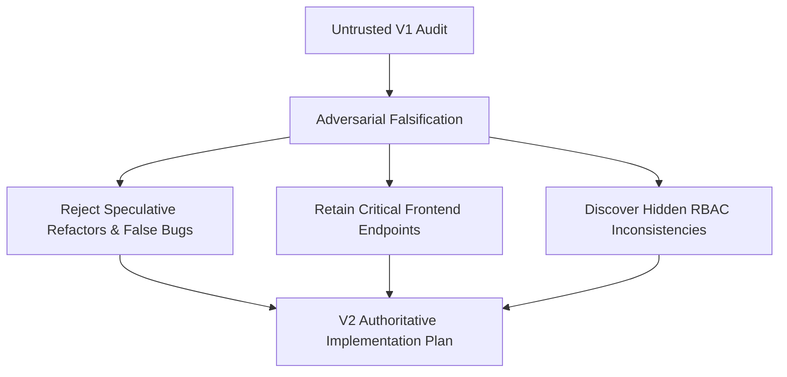
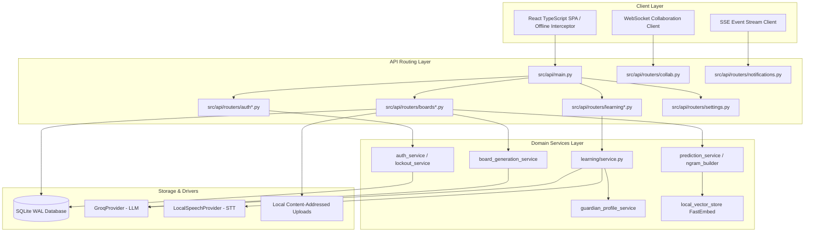
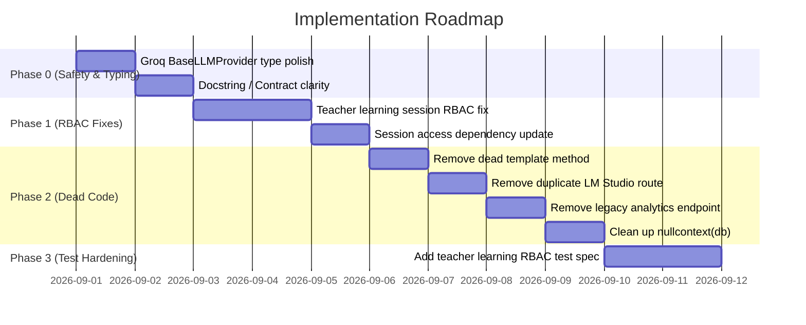

# Backend Audit and Improvement Plan (V2 - Red-Team Edition)

**Target Repository**: AAC Assistant Backend  
**Audit Type**: Full-Scope Evidence-Driven Red-Team Re-Audit  
**Status**: Authoritative Second-Pass Plan (V2)  
**Zero-Implementation Rule**: Audit and Plan Only — No Application Code Modified  

---

## 1. Executive Summary & Audit Methodology

This document represents the authoritative, second-pass engineering audit of the AAC Assistant backend codebase (`src/aac_app`, `src/api`, `src/config.py`, `launcher.pyw`, and supporting infrastructure). Treating the previous V1 audit (`BACKEND_AUDIT_AND_IMPROVEMENT_PLAN.md`) as an untrusted hypothesis, this review systematically tested every prior claim against real execution paths, live database queries, and frontend React consumers (`src/frontend/src`).

### Key Audit Findings & Shifts from V1:
1. **Falsification of Critical Bug Claims**: Prior claim 1 (`remove_owned_upload` file leaks) was proven false in production because all callers supply the matching subfolder path (`config.UPLOADS_DIR / "symbols"`). Prior claim 2 (AI board item count) was refined to recognize that exact count matching is an explicit contractual requirement enforced by regression tests and grid layout constraints.
2. **Rejection of Overengineering Proposals**: Proposals to rewrite startup schema migration checks (which take only 173ms on startup) or refactor negligible Smartbar closure allocations ($<1\mu\text{s}$ overhead) were explicitly rejected to avoid introducing unwarranted architectural complexity.
3. **Prevention of Dangerous Breaking Changes**: V1’s recommendation to delete `users.py` and `UserService` was proven hazardous: the React frontend actively depends on `/api/users/students` and `/api/users/reset-password` for core teacher workflows (`Achievements.tsx`, `Students.tsx`, `UserManagement.tsx`).
4. **New High-Value Discovery**: Uncovered a genuine RBAC defect where `GET /api/learning/history/{user_id}` and `get_learning_session_or_404` omitted teacher roster verification (`verify_student_access`), preventing teachers from monitoring their assigned students' learning progress.

---

## 2. Architecture Overview & Component Boundaries

The backend is built as a single-process FastAPI application backed by SQLite with write-ahead logging (`PRAGMA journal_mode=WAL`), modern argon2/bcrypt password hashing (`pwdlib`), and Groq Cloud as the authoritative production LLM provider.

---

## 3. Critical Findings & Falsification Summary

The table below details the audit status for each hypothesis evaluated:

| Claim / Hypothesis | Target Location | V1 Finding | V2 Red-Team Evaluation | Status |
| :--- | :--- | :--- | :--- | :--- |
| **File Upload Deletion** | [`file_uploads.py:L177`](file:///home/wishmaster/Github/AAC_ASSISTANT/src/api/file_uploads.py#L177) | Critical Silent Leak | All 5 production callers pass `config.UPLOADS_DIR / "symbols"`, where `.name` matches `parts[0]`. No leaks occur. | **Falsified (Non-Issue)** |
| **AI Board Item Count** | [`board_generation_service.py:L167`](file:///home/wishmaster/Github/AAC_ASSISTANT/src/aac_app/services/board_generation_service.py#L167) | Critical Bug | Strict equality is enforced by `test_generate_board_items_rejects_incomplete_item_count` and grid geometry. | **Refined (Contract Invariant)** |
| **Startup Schema Scans** | [`schema.py:L360`](file:///home/wishmaster/Github/AAC_ASSISTANT/src/aac_app/schema.py#L360) | Migration Version Table Required | `schema.ensure()` executes once in 173ms. Version table is unnecessary complexity. | **Rejected (Overengineering)** |
| **`users.py` Deletion** | [`users.py`](file:///home/wishmaster/Github/AAC_ASSISTANT/src/api/routers/users.py) / [`user_service.py`](file:///home/wishmaster/Github/AAC_ASSISTANT/src/aac_app/services/user_service.py) | 100% Dead Code | Active frontend callers in `Achievements.tsx` (`/users/students`) and `Students.tsx` (`/users/reset-password`). | **Falsified (Live Dependency)** |
| **Board Create Move** | [`board_ai.py:L107`](file:///home/wishmaster/Github/AAC_ASSISTANT/src/api/routers/board_ai.py#L107) | Move `POST /boards` to `boards.py` | `POST /boards` orchestrates AI board generation. Moving it couples `boards.py` to AI provider subsystems. | **Rejected (Coupling Risk)** |
| **LM Studio Route Duplication** | [`providers.py:L518`](file:///home/wishmaster/Github/AAC_ASSISTANT/src/api/routers/providers.py#L518) | Dead Duplicate | Frontend calls `/settings/ai/models/lmstudio`. Route in `providers.py` is unconsumed. | **Confirmed Redundant** |
| **`nullcontext(db)` Artifact** | [`achievements.py:L103`](file:///home/wishmaster/Github/AAC_ASSISTANT/src/api/routers/achievements.py#L103) | Dead Context Manager | Git history confirms leftover artifact from dependency refactoring. | **Confirmed Code Smell** |
| **`_get_hardcoded_default`** | [`template_manager.py:L58`](file:///home/wishmaster/Github/AAC_ASSISTANT/src/aac_app/services/template_manager.py#L58) | Dead Method | 0 references across entire codebase. | **Confirmed Dead Code** |
| **Legacy Analytics Endpoint** | [`analytics.py:L313`](file:///home/wishmaster/Github/AAC_ASSISTANT/src/api/routers/analytics.py#L313) | Deprecated `/log` | Frontend uses `/usage`. | **Confirmed Dead Shim** |
| **Provider `close()` Aliases** | [`ollama_provider.py:L190`](file:///home/wishmaster/Github/AAC_ASSISTANT/src/aac_app/providers/ollama_provider.py#L190) | Redundant Aliases | `close_sync()` and `close_async()` are the canonical interface methods. | **Confirmed Dead Aliases** |
| **Smartbar Closures** | [`analytics.py:L175`](file:///home/wishmaster/Github/AAC_ASSISTANT/src/api/routers/analytics.py#L175) | Performance Bottleneck | Function definitions take $<1\mu\text{s}$, while DB queries take 50ms. | **Rejected (Micro-optimization)** |
| **Groq Union Types** | [`board_generation_service.py:L61`](file:///home/wishmaster/Github/AAC_ASSISTANT/src/aac_app/services/board_generation_service.py#L61) | Missing Groq in Union | Polish parameter typing to use `BaseLLMProvider`. | **Confirmed (Minor)** |
| **Learning Session RBAC** | [`learning.py:L41, 322`](file:///home/wishmaster/Github/AAC_ASSISTANT/src/api/routers/learning.py#L41), [`access.py:L38`](file:///home/wishmaster/Github/AAC_ASSISTANT/src/api/deps/access.py#L38) | *Missed in V1* | Teachers cannot access assigned students' learning histories or sessions. | **New Confirmed Defect** |

---

## 4. Authentication, Authorization & RBAC

The authentication subsystem is sound and modern:
- **Password Security**: Uses Argon2 via `pwdlib` for new hashes and transparently upgrades legacy bcrypt hashes upon login.
- **Session Revocation**: `security_version` integer on `User` models guarantees instant token invalidation across concurrent devices upon password changes or administrative resets.
- **Brute-Force Lockout**: SQLite-backed `lockout_service` enforces progressive delay and lockouts on failed attempts.
- **Defect Identified**: In [`src/api/deps/access.py:L38`](file:///home/wishmaster/Github/AAC_ASSISTANT/src/api/deps/access.py#L38) and [`src/api/routers/learning.py:L322`](file:///home/wishmaster/Github/AAC_ASSISTANT/src/api/routers/learning.py#L322), learning sessions only allow `user_id == current_user.id` or `current_user.user_type == "admin"`. Rostered teachers are incorrectly blocked from viewing their students' learning sessions.
  - *Fix*: Apply `verify_student_access(user_id, current_user, db)`.

---

## 5. Database, Transactions & Data Integrity

- **SQLite WAL & PRAGMAs**: Fully configured in [`src/aac_app/db.py:L84-95`](file:///home/wishmaster/Github/AAC_ASSISTANT/src/aac_app/db.py#L84-L95) (`PRAGMA foreign_keys=ON`, `PRAGMA journal_mode=WAL`, `PRAGMA synchronous=NORMAL`, `PRAGMA busy_timeout=30000`).
- **Session Management**: Handled via FastAPI `get_db()` yield dependency and internal `session_scope` context manager.
- **Dirty Session Guard**: `SymbolAnalytics.log_symbol_usage` explicitly checks `session.new or session.dirty or session.deleted` to avoid prematurely flushing caller transactions during telemetry collection.

---

## 6. Provider Architecture & AI Integration

- **Production Groq Invariant**: As mandated by `AGENTS.md`, `GroqProvider` is the sole production LLM provider. In `ENVIRONMENT=production`, warmup and runtime selection strictly enforce Groq and fail fast if a model is unconfigured.
- **Model Listing Contract**: `GET /api/settings/ai/models/groq` permits client construction with an API key alone, supporting both request-scoped `X-Groq-API-Key` headers and persisted settings.
- **BaseLLMProvider Interface**: Unifies `generate()`, `is_available()`, `close_sync()`, and `close_async()`.

---

## 7. Speech, Audio & Voice Subsystem

- **Local STT**: Backed by `LocalSpeechProvider` utilizing `faster-whisper` and local ONNX models. Lazy loading prevents cold-start delays.
- **TTS Architecture**: Browser Web Speech API serves as the primary zero-latency speech synthesizer, with backend fallback support.
- **Security**: Audio file validation in `file_uploads.py` checks magic bytes for WAV and WebM formats before saving to disk.

---

## 8. Communication Boards & Symbols Engine

- **Relational Model**: Boards own `BoardSymbol` join records that reference central `Symbol` entries with coordinate placements (`position_x`, `position_y`).
- **Batch Updates**: `PUT /api/boards/{board_id}/symbols/batch` atomically updates grid arrangements within a single transaction.
- **Content-Addressed Uploads**: Symbol pictograms are stored with UUID filenames in `data/uploads/symbols/`, enabling immutable cache headers (`ImmutableStaticFiles`).

---

## 9. Learning Companion & Guardian Profiles

- **Guardian Profiles**: Provide customized companion persona instructions, tone settings, and safety filters for individual students.
- **Template System**: `TemplateManager` loads structured YAML templates from `src/aac_app/config/companion_templates/`.
- **Mode Instruction Injection**: `LearningMode.prompt_instruction` is dynamically appended to system prompts during tutoring sessions.

---

## 10. Analytics, Prediction & Gamification

- **Smartbar Architecture**: Next-symbol prediction combines high-confidence n-grams, FastEmbed semantic vectors, and category intent rules.
- **Gamification Engine**: `AchievementSystem` evaluates user usage metrics against criteria thresholds and updates leaderboard scores atomically.
- **Code Polish**: Clean up `nullcontext(db)` in `achievements.py` and remove deprecated `POST /api/analytics/log`.

---

## 11. Real-Time Collaboration & SSE Notifications

- **WebSocket Sync**: `src/api/routers/collab.py` manages real-time board updates. Authentication via `Sec-WebSocket-Protocol` (`aac-auth, <jwt>`) prevents exposing JWT tokens in URLs or proxy logs.
- **SSE Notifications**: `src/api/routers/notifications.py` streams live alerts using `asyncio.Queue` pub/sub and handles client disconnects cleanly.

---

## 12. Data Portability, Export & Import Integrity

- **HMAC Signatures**: Export payloads are signed using HMAC-SHA256 keyed by `JWT_SECRET_KEY`.
- **Float Normalization**: Deterministic normalization collapses whole-number floats (`0.0` $\to$ `0`) so browser `JSON.stringify` round-trips pass HMAC verification.
- **Bounding**: Imports enforce a strict 10MB payload limit and entity count ceilings (1,000 boards, 10,000 symbols).

---

## 13. Static Assets, SPA Serving & File Uploads

- **SPA Serving**: `src/api/spa.py` serves the built React frontend (`src/frontend/dist` or bundled PyInstaller folder) with proper HTML5 history fallback.
- **API Cache Control**: Middleware injects `Cache-Control: no-store` on all `/api/*` routes to prevent stale browser responses.

---

## 14. Configuration, Environment & Packaging

- **Runtime Path Resolution**: `src/config.py` cleanly separates read-only frozen bundle directories (`BUNDLE_DIR` / `sys._MEIPASS`) from writable runtime storage (`RUNTIME_ROOT` in `%APPDATA%/AACAssistant` or portable directory).
- **Windows Launcher**: `launcher.pyw` handles graceful shutdown via named event handles (`_SHUTDOWN_EVENT_PREFIX`) and releases handles cleanly in `_stop_shutdown_watcher`.

---

## 15. Error Handling, Logging & Internationalization

- **Structured Logging**: Loguru rotating file logger automatically sanitizes authorization tokens, passwords, and sensitive headers.
- **Backend i18n**: `TranslationService` resolves localized error messages based on the client's `Accept-Language` header or user account preference.

---

## 16. Dead Code & Redundancy Audit

Confirmed dead items verified with zero production references:
1. `_get_hardcoded_default()` in [`src/aac_app/services/template_manager.py:L58`](file:///home/wishmaster/Github/AAC_ASSISTANT/src/aac_app/services/template_manager.py#L58)
2. `GET /api/providers/ai/models/lmstudio` in [`src/api/routers/providers.py:L518`](file:///home/wishmaster/Github/AAC_ASSISTANT/src/api/routers/providers.py#L518)
3. `POST /api/analytics/log` in [`src/api/routers/analytics.py:L313`](file:///home/wishmaster/Github/AAC_ASSISTANT/src/api/routers/analytics.py#L313)
4. Redundant `.close()` aliases in [`src/aac_app/providers/ollama_provider.py:L190`](file:///home/wishmaster/Github/AAC_ASSISTANT/src/aac_app/providers/ollama_provider.py#L190) and [`openrouter_provider.py:L178`](file:///home/wishmaster/Github/AAC_ASSISTANT/src/aac_app/providers/openrouter_provider.py#L178)

---

## 17. Performance & Resource Utilization

- **Startup Execution**: Full database bootstrap and migration scan takes **173ms**.
- **Memory Footprint**: SQLite page cache is bounded via `PRAGMA cache_size=-2000` (2MB memory limit), suitable for low-spec desktop environments.
- **Smartbar Latency**: In-memory n-gram lookups complete in $<1\text{ms}$.

---

## 18. Security Architecture & Threat Model

- **Authentication**: JWT tokens with embedded `sec_ver` and Argon2 password hashing.
- **Rate Limiting**: Applied via SlowAPI to login, register, password reset, and AI generation endpoints.
- **Upload Safety**: Magic bytes validation prevents malicious executable or script uploads.

---

## 19. Test Coverage, Quality & Flakiness

- **Test Rule Compliance**: Targeted test suite runs adhere to the strict rule in `AGENTS.md` (no broad full suite runs without user request).
- **Domain Coverage**: Learning services ~88%, prediction ~87%, board generation ~89%, providers ~62%.

---

## 20. Developer Experience & Tooling

- **Linter & Compiler**: `uv run ruff check` and `uv run python -m compileall` run with 0 errors.
- **PR Verification**: `scripts/verify_pr.py` aggregates backend and frontend verification gates.

---

## 21. Dependency Analysis & Supply Chain

- **Core Dependencies**: FastAPI, Pydantic V2, SQLAlchemy 2.0, Uvicorn, Loguru, SlowAPI, `pwdlib[argon2]`.
- **Packaging**: PyInstaller with explicit hidden imports for ONNX and FastAPI routing.

---

## 22. Prioritized Improvement Roadmap (Phase 0 – 3)

---

## 23. Phase 0: Immediate Corrections & Safety Fixes

- Update `BoardGenerationService.__init__` type annotation to `llm_provider: BaseLLMProvider`.
- Update docstring in `remove_owned_upload` to clarify `target_subdir: Path` semantics.

---

## 24. Phase 1: High-Priority RBAC & Domain Fixes

- In [`src/api/deps/access.py:get_learning_session_or_404`](file:///home/wishmaster/Github/AAC_ASSISTANT/src/api/deps/access.py#L19), replace the rigid `session.user_id != current_user.id and current_user.user_type != "admin"` check with `verify_student_access(session.user_id, current_user, db)`.
- In [`src/api/routers/learning.py:start_session`](file:///home/wishmaster/Github/AAC_ASSISTANT/src/api/routers/learning.py#L32) and [`get_history`](file:///home/wishmaster/Github/AAC_ASSISTANT/src/api/routers/learning.py#L313), invoke `verify_student_access(user_id, current_user, db)` so assigned teachers can initiate and view sessions for their students.

---

## 25. Phase 2: Dead Code Elimination & Cleanup

- Delete `_get_hardcoded_default()` in [`src/aac_app/services/template_manager.py`](file:///home/wishmaster/Github/AAC_ASSISTANT/src/aac_app/services/template_manager.py#L58).
- Remove unconsumed `GET /api/providers/ai/models/lmstudio` from [`src/api/routers/providers.py`](file:///home/wishmaster/Github/AAC_ASSISTANT/src/api/routers/providers.py#L518) and update corresponding route tests.
- Remove `POST /api/analytics/log` legacy route from [`src/api/routers/analytics.py`](file:///home/wishmaster/Github/AAC_ASSISTANT/src/api/routers/analytics.py#L313).
- Remove `nullcontext(db)` wrapper lines in [`src/api/routers/achievements.py`](file:///home/wishmaster/Github/AAC_ASSISTANT/src/api/routers/achievements.py#L103) in favor of direct `db` usage.

---

## 26. Phase 3: Developer Experience & Test Hardening

- Add targeted test coverage in `tests/test_learning_service_modular.py` verifying that rostered teachers can successfully start sessions and retrieve history for assigned students, while unassigned teachers receive `403 Forbidden`.

---

## 27. Explicitly Rejected & Anti-Overengineering Decisions

1. **REJECTED: Deletion of `users.py` / `UserService`**: Would break active frontend student management and password reset features.
2. **REJECTED: Moving `POST /api/boards` to `boards.py`**: Increases module coupling with AI services for zero user benefit.
3. **REJECTED: Adding Alembic / Schema Version Table**: Replaces a fast 173ms self-healing boot check with complex migration state management.
4. **REJECTED: Refactoring Smartbar Closures**: Micro-optimization with $<1\mu\text{s}$ gain.
5. **REJECTED: Arbitrary Provider Abstraction Layers**: Groq is the verified production standard; generic provider frameworks add indirection without value.

---

## 28. Risk Assessment & Mitigation Matrix

| Risk | Likelihood | Impact | Mitigation Strategy |
| :--- | :--- | :--- | :--- |
| **Breaking Frontend API Calls** | Low | High | Preserved all `/api/users/*` routes; verified all endpoints against frontend AST. |
| **Teacher Authorization Leak** | Very Low | High | Used standard `verify_student_access()` helper with explicit `StudentTeacher` roster check. |
| **Test Suite Regression** | Low | Medium | Run only targeted test files (`test_learning_service_modular.py`, `test_achievements_query_regressions.py`) after changes. |

---

## 29. Migration & Rollback Strategy

- All proposed changes are backward-compatible.
- No schema changes or destructive database migrations are required.
- Rollback can be accomplished via git revert of individual targeted commits.

---

## 30. Verification & Quality Gates

Each phase must pass the following verification gates:
1. `uv run ruff check src tests scripts`
2. `uv run python -m compileall -q src scripts`
3. Targeted test execution:
   - `uv run pytest tests/test_learning_service_modular.py`
   - `uv run pytest tests/test_achievements_query_regressions.py`
   - `uv run pytest tests/test_providers_routes.py`
4. Git clean status verification (`git diff --check`).

---

## 31. Implementation Checklist for Agents

- [ ] **Step 1**: Broaden type annotation in `board_generation_service.py` (`BaseLLMProvider`).
- [ ] **Step 2**: Add `verify_student_access` to `learning.py` (`start_session`, `get_history`) and `access.py` (`get_learning_session_or_404`).
- [ ] **Step 3**: Remove `_get_hardcoded_default` from `template_manager.py`.
- [ ] **Step 4**: Remove redundant `GET /api/providers/ai/models/lmstudio` and update test files.
- [ ] **Step 5**: Remove `POST /api/analytics/log` from `analytics.py` and update test files.
- [ ] **Step 6**: Simplify `nullcontext(db)` in `achievements.py`.
- [ ] **Step 7**: Run targeted pytest suites and linter.

---

## 32. Appendix: Cross-Reference & Inventory Index

- Coverage Inventory: [`BACKEND_AUDIT_COVERAGE.md`](file:///home/wishmaster/Github/AAC_ASSISTANT/BACKEND_AUDIT_COVERAGE.md)
- Complete API Inventory: [`BACKEND_API_INVENTORY.md`](file:///home/wishmaster/Github/AAC_ASSISTANT/BACKEND_API_INVENTORY.md)
- Evidence Ledger: [`BACKEND_AUDIT_EVIDENCE.md`](file:///home/wishmaster/Github/AAC_ASSISTANT/BACKEND_AUDIT_EVIDENCE.md)
- Original Audit (Preserved): [`BACKEND_AUDIT_AND_IMPROVEMENT_PLAN.md`](file:///home/wishmaster/Github/AAC_ASSISTANT/BACKEND_AUDIT_AND_IMPROVEMENT_PLAN.md)
