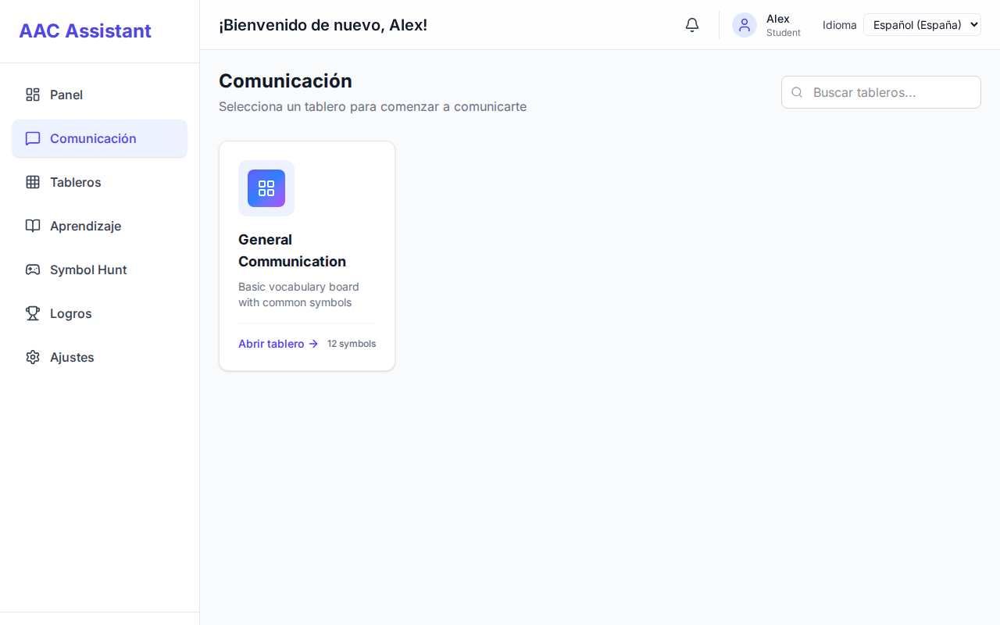
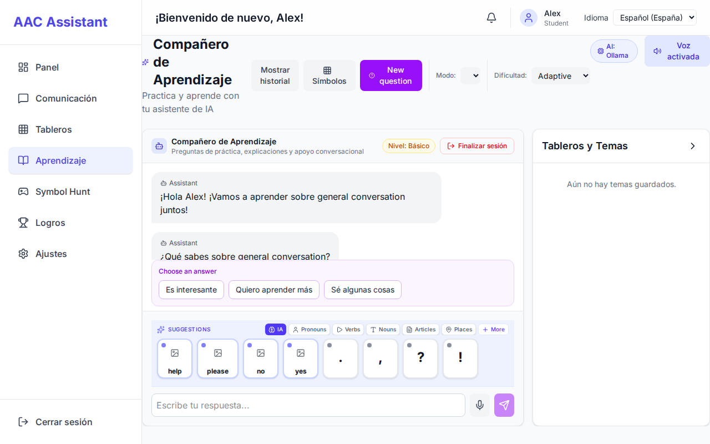
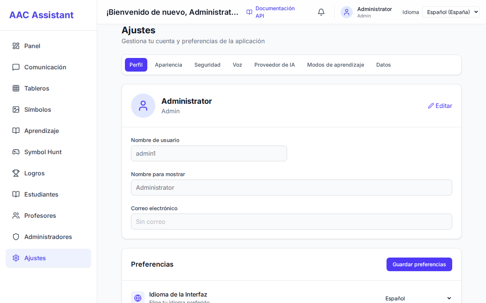
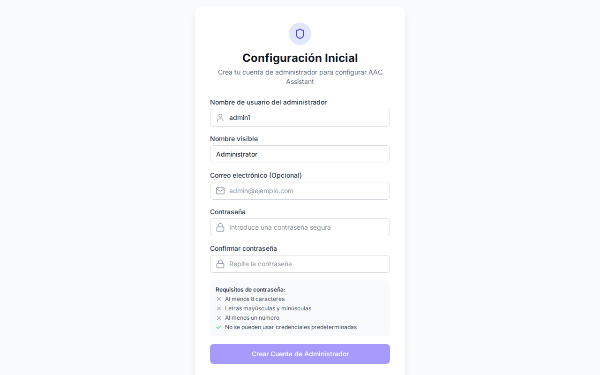
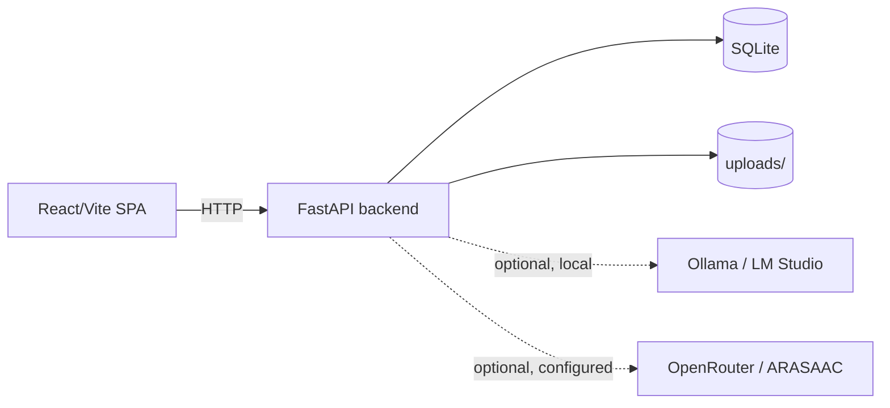

# AAC Assistant

[](https://github.com/rodhayl/AAC_ASSISTANT/actions/workflows/ci.yml)
[](https://github.com/rodhayl/AAC_ASSISTANT/releases/latest)
[](LICENSE)

**A local-first, privacy-focused communication platform for people with speech
and communication disabilities.**

AAC Assistant provides communication boards, symbol search, sentence building,
learning sessions, and browser-based speech — all running on the operator's own
machine so sensitive communication stays under local control.

## The problem

Augmentative and alternative communication (AAC) software helps people who
cannot rely on speech to express themselves. Many AAC tools depend on cloud
services, which can put highly personal communication data outside the user's
control. AAC Assistant is built local-first: core AAC communication works offline
after installation, and no cloud account, analytics, or telemetry is required.
Optional integrations may access external services only when explicitly enabled
by the operator.

## Who it is for

- **People who use AAC** — to build sentences from symbol boards and learn new
  vocabulary.
- **Caregivers, teachers, and therapists** — to create boards, assign them to
  students, run learning sessions, and review progress.
- **Administrators** — to manage users, roles, and settings on a local install.

## Product tour

*Screenshots use fictional demonstration data.*

### 1. Communication board & sentence strip
Grid-based symbol navigation with real-time sentence construction, symbol library management, and instant speech output.



### 2. Adaptive learning sessions
Structured symbol identification and vocabulary exercises with instant multi-modal feedback and student progress tracking.



### 3. Local administration & accessibility
Manage users and roles, assign personalized boards, customize high-contrast themes, configure speech voices, and manage offline AI providers.



### 4. Interactive first-run setup
One-time onboarding flow restricted to local loopback (`127.0.0.1`) requiring operator-chosen strong credentials before initial administrator creation.



## Key features

- Communication boards with a symbol library and sentence strip.
- Symbol search and board editing (drag-and-drop, custom uploads).
- Learning sessions with adaptive questions and achievements.
- Local speech-to-text (faster-whisper) bundled in the Windows installer;
  browser-based text-to-speech works everywhere. Optional local neural TTS
  (Kokoro) is supported on Python 3.13; Python 3.14 uses the browser fallback
  because the current Kokoro release does not support Python 3.14.
- Role-based accounts (student / teacher / admin) with per-endpoint
  authorization.
- Optional LLM learning questions via local services (Ollama, LM Studio) or an
  operator-configured OpenRouter key. The core AAC experience never depends on
  any cloud service.

## Local-first and privacy

- Data (accounts, boards, learning, uploads) is stored in local files.
- The backend binds to `127.0.0.1` by default and is not reachable from the
  network unless the operator explicitly opts in.
- No telemetry, analytics, or crash upload.
- See [docs/PRIVACY_AND_DATA.md](docs/PRIVACY_AND_DATA.md).

## Current status

Actively maintained. The codebase has an automated backend test suite, a
frontend unit/component suite, and a Playwright end-to-end suite that exercises
core flows against the real backend. See
[docs/PROJECT_METRICS.md](docs/PROJECT_METRICS.md) for a dated, verifiable
snapshot.

## Supported platforms

- **Windows 10/11** — packaged portable/installer build.
- **Source checkout** — any OS with Python 3.13 or 3.14 and Node.js 22.22+.

## Prerequisites (source checkout)

- Windows 10+ (for the packaged build) or Linux/macOS (source only)
- Python 3.13 or 3.14
- [uv](https://docs.astral.sh/uv/)
- Node.js 22.22+ and npm 10+ (to build or run the frontend)

The packaged Windows application requires neither Python nor Node.js.

## Installation and first run

### Packaged Windows application

Download the latest installer (`AAC_Assistant_Setup_2.0.0.exe`) from the [GitHub Releases](https://github.com/rodhayl/AAC_ASSISTANT/releases/latest) page and run the setup wizard.

Alternatively, to build the installer locally from source on Windows:
```bat
build_package.bat
```
This produces `dist\AAC_Assistant_Setup_2.0.0.exe`. The installer is an update-aware wizard; uninstalling preserves your database and uploads.

### Source checkout (Windows)

```bat
install_dependencies.bat
```

This bootstraps `uv` if missing, syncs dependencies, creates/migrates `.env`,
repairs the JWT secret, and builds the frontend. Add `voice` for optional
speech-to-text:

```bat
install_dependencies.bat voice
```

Then run:

```bat
start.bat
```

and open `http://127.0.0.1:8086/`.

### Source checkout (Linux / macOS)

```bash
uv sync --group dev
npm --prefix src/frontend ci
npm --prefix src/frontend run build
uv run python -m uvicorn src.api.main:app --host 127.0.0.1 --port 8086
```

and open `http://127.0.0.1:8086/`.

### First-run administrator setup

On first run, when no administrator account exists, opening the web interface at
`http://127.0.0.1:8086/` automatically redirects to the initial setup screen (`/setup`)
where you choose your administrator username and a strong password. Initial setup
is strictly restricted to local loopback (`127.0.0.1` / `::1`) to prevent remote
takeover on fresh installations.

Alternatively, operators can configure `AAC_BOOTSTRAP_ADMIN_PASSWORD` in `.env` or the
process environment before starting the server. In production (`ENVIRONMENT=production`),
bootstrap refuses to initialize without an explicit, strong password. Deterministic test
credentials (`Admin123`) operate only in explicit test environments (`TESTING=1`).

## Development setup

```powershell
uv sync --group dev
npm --prefix src/frontend ci
npm --prefix src/frontend run build
```

Run the backend and Vite development server:

```powershell
uv run python -m uvicorn src.api.main:app --host 127.0.0.1 --port 8086
npm --prefix src/frontend run dev -- --host 127.0.0.1 --port 5176
```

Useful endpoints:

- Application: `http://127.0.0.1:8086/`
- Swagger: `http://127.0.0.1:8086/docs`
- Health check: `http://127.0.0.1:8086/api/health`

## Test and validation

```powershell
uv run ruff check src tests scripts
uv run python -m compileall -q src scripts
uv run pytest -q
npm --prefix src/frontend run typecheck
npm --prefix src/frontend run lint
npm --prefix src/frontend run test -- --run
npm --prefix src/frontend run build
```

The Playwright suite runs against a real production server; see
`src/frontend/e2e/`.

## Configuration

Configuration is read from `.env` (copy `.env.example` as a starting point).
Process environment variables take precedence over the file. Key settings:

| Key | Default | Meaning |
| --- | --- | --- |
| `BACKEND_HOST` | `127.0.0.1` | Address the backend binds to. `0.0.0.0` opts into network exposure. |
| `BACKEND_PORT` | `8086` | API and production SPA port. |
| `JWT_SECRET_KEY` | generated | JWT signing secret; a stable random value is created on first run. |
| `ALLOWED_ORIGINS` | localhost allowlist | CORS origins (explicit; `*` is rejected). |
| `ENVIRONMENT` | `development` | `production` enables stricter bootstrap/security checks. |
| `ALLOW_DB_RESET` | `false` | Enables the admin DB-reset endpoint (keep false). |
| `AAC_SEED_SAMPLE_DATA` | `false` | Seeds demo users/boards (keep false in production). |
| `AAC_BOOTSTRAP_ADMIN_ON_FIRST_RUN` | `true` | Enables interactive setup (/setup) or automatic bootstrap when no admin exists. |
| `AAC_BOOTSTRAP_ADMIN_USERNAME` | `admin1` | Username for the first-run admin. |
| `AAC_BOOTSTRAP_ADMIN_PASSWORD` | unset | Unset by default; operators set a strong password via `/setup` (loopback only). Production requires an explicit password. |

See `docs/01_PROJECT_GUIDE.md` for the full reference.

## Architecture



One FastAPI process serves the API and the built SPA. Domain logic lives in
`src/aac_app/` (models, services, providers); HTTP routing in `src/api/`; the
React application in `src/frontend/`. See
[docs/01_PROJECT_GUIDE.md](docs/01_PROJECT_GUIDE.md).

## Security

- Local-first: loopback bind by default, no telemetry.
- Argon2 password hashing, JWT sessions with revocation on password change,
  login rate limiting and account lockout.
- Role checks on every protected backend endpoint; validated user updates.
- Hardened uploads (size, MIME, signature, and path-traversal checks).

Read [.github/SECURITY.md](.github/SECURITY.md) for supported versions and how to report a
vulnerability privately, [docs/THREAT_MODEL.md](docs/THREAT_MODEL.md) for the
threat model, and [docs/SECURITY_ARCHITECTURE.md](docs/SECURITY_ARCHITECTURE.md)
for the implementation detail.

## Accessibility

Accessibility is core to this project. See
[docs/ACCESSIBILITY.md](docs/ACCESSIBILITY.md) for what is tested, known
limitations, and future work. We do not currently claim formal WCAG
conformance.

## Documentation

For an overview of all architecture, security, testing, and operations
guides, see the [Documentation Index](docs/README.md).

## Packaging and releases

```powershell
uv sync --group dev
npm --prefix src/frontend ci
build_package.bat
```

Outputs: `dist\AAC_Assistant\AAC_Assistant.exe` and
`dist\AAC_Assistant_Setup_<version>.exe`. See
[docs/RELEASE_READINESS.md](docs/RELEASE_READINESS.md) and
[CHANGELOG.md](CHANGELOG.md).

## Contributing

Contributions are welcome. See [.github/CONTRIBUTING.md](.github/CONTRIBUTING.md) and the
[Code of Conduct](.github/CODE_OF_CONDUCT.md). Questions belong in
[.github/SUPPORT.md](.github/SUPPORT.md); the [ROADMAP.md](docs/ROADMAP.md) lists planned work.

## License

MIT. See [LICENSE](LICENSE).
