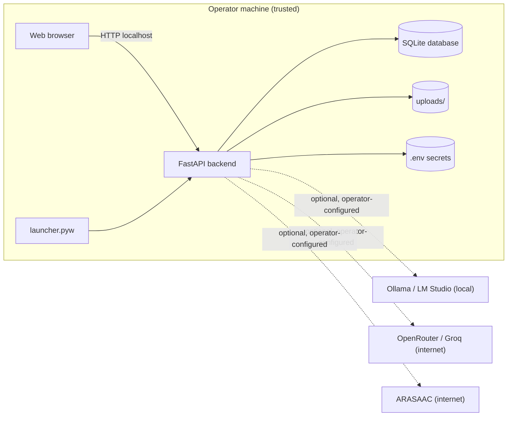

# Threat Model

This document describes the security assumptions and residual risks for AAC
Assistant. It is a design aid for maintainers and reviewers, not an exhaustive
security audit.

## 1. System overview

AAC Assistant is a local-first desktop/web application for augmentative and
alternative communication (AAC). One FastAPI process serves a REST API and a
built React single-page application. Data (accounts, boards, symbols, learning
sessions, achievements, uploads) is stored in local SQLite files. Optional
AI/voice features may call local or third-party services.

## 2. Protected assets

| Asset | Sensitivity | Location |
| ----- | ----------- | -------- |
| Communication content (sentences, boards, symbols) | High — private health/communication data | SQLite DB |
| User accounts, password hashes, roles | High | SQLite DB |
| Uploaded images and audio | High | `uploads/` directory |
| JWT signing secret | High — forges sessions if leaked | `.env` |
| Optional API keys (OpenRouter, Groq) | High | `AppSettings` table / `.env` |
| Learning sessions and achievements | Medium | SQLite DB |

## 3. Trust boundaries

- **Operator machine** — the machine running the application. The operator is
  the trusted party who installs and administers the software.
- **Browser/API boundary** — the primary attack surface. It is exposed only on
  `127.0.0.1` by default.
- **External services** — only reachable when the operator configures them.
  Core AAC communication never depends on them.

## 4. Threat actors

| Actor | Motivation | Capability |
| ----- | ---------- | ---------- |
| Local malicious process | Data theft, tampering | Reads/writes local files; can bind local ports |
| Same-network attacker | Unauthorized access | Can reach the service only if the operator binds `0.0.0.0` |
| Malicious authenticated user | Privilege escalation | Limited by role checks on every endpoint |
| Compromised optional API key | Cost/latency abuse | Bounded to the configured third-party account |
| Supply-chain attacker | Backdoors | Mitigated by lockfiles, pinned actions, review |

## 5. Entry points

- `POST /api/auth/token` — login (rate-limited, account lockout).
- Authenticated API routers (`/api/boards`, `/api/learning`, `/api/admin`,
  `/api/export`, `/api/auth/users`, etc.).
- Multipart upload endpoints (images, audio).
- Static SPA and `/uploads` file serving.
- The `launcher.pyw` / installer lifecycle.

## 6. Abuse cases and mitigations

| Abuse case | Mitigation |
| ---------- | ---------- |
| Brute-force login | 10/min IP rate limit + 5-failure account lockout |
| Predictable bootstrap credential | Interactive `/setup` flow (loopback-only) requires a strong password; production refuses unconfigured startup bootstrap; legacy defaults rejected |
| Remote first-run takeover | `POST /api/auth/setup` is restricted to local loopback clients (`127.0.0.1` / `::1`); remote deployments must configure credentials via deployment configuration |
| Privilege escalation via role change | Admin-only endpoints; `user_type` validated against a fixed allowlist |
| Mass-assignment via raw dict bodies | Typed/validated request models; `update_user` validates role, email, active flag |
| Path traversal / oversized uploads | Bounded chunked reads, MIME/signature checks, pixel limits, path containment in `file_uploads.py` |
| Forgery of sessions | Random 64-hex JWT secret generated on first run; token revocation on password change |
| Cross-origin abuse | Explicit `ALLOWED_ORIGINS` allowlist; `*` rejected when credentialed |
| Remote exposure | Loopback bind by default; remote bind is explicit and documented |
| Unauthorized DB reset | `ALLOW_DB_RESET` defaults to `false` |
| Dependency backdoors | Lockfiles (`uv.lock`, `package-lock.json`), pinned GitHub Actions |

## 7. Residual risks

- A process running with the same OS user as the operator can read the SQLite
  database and `.env` directly. This is inherent to local-first desktop
  software; OS-level account isolation is the operator's responsibility.
- If the operator deliberately binds `0.0.0.0`, the application is reachable
  from the network. This is an explicit, documented opt-in and requires strong
  credentials.
- The desktop app does not encrypt data at rest. Full-disk encryption is
  recommended for devices that contain sensitive communication content.
- Optional LLM/voice providers that send content off-device are only used when
  the operator configures them; their privacy terms apply to that content.

## 8. Out-of-scope assumptions

- Physical theft of the device is not modeled (use disk encryption).
- A fully trusted operator is assumed.
- Cloud deployments, reverse proxies, and multi-user hosting are not supported
  or reviewed; the application is a local-first tool.

## 9. Security-relevant configuration

| Setting | Safe default |
| ------- | ------------ |
| `BACKEND_HOST` | `127.0.0.1` |
| `ALLOW_DB_RESET` | `false` |
| `AAC_SEED_SAMPLE_DATA` | `false` |
| `ALLOWED_ORIGINS` | explicit localhost allowlist |
| `AAC_BOOTSTRAP_ADMIN_PASSWORD` | unset → no admin seeded; operator configures strong password via `/setup` (loopback only) |
| `JWT_SECRET_KEY` | unset → random 64-hex secret generated |
